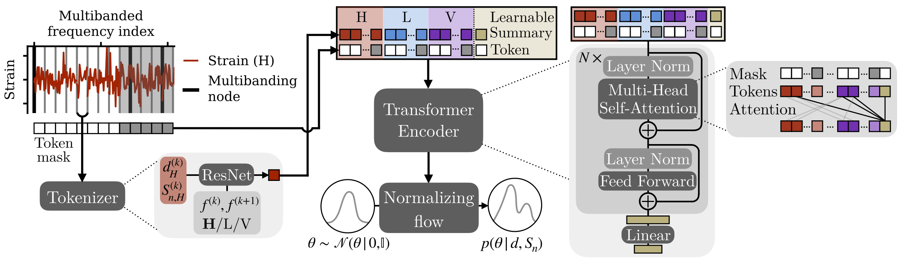
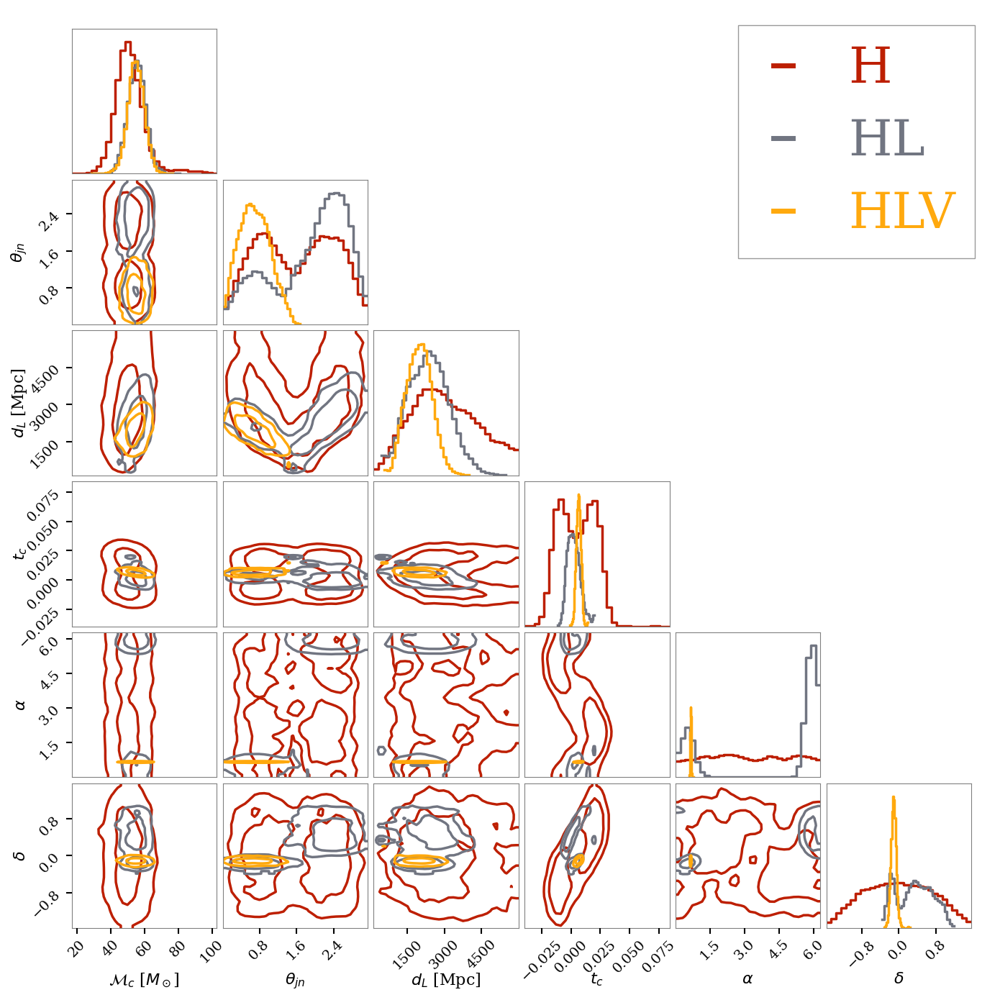

# DINGO-T1: Flexible Gravitational-Wave Parameter Estimation with Transformers

This is the companion repository for the preprint `Flexible Gravitational-Wave Parameter Estimation with Transformers`, 
which introduces a flexible transformer-based architecture paired with a training strategy that enables adaptation 
to diverse gravitational wave~(GW) analysis settings at inference time.
We call the final model DINGO-T1 (DINGO Transformer, version 1) which we make publicly available on 
[Zenodo](https://zenodo.org/records/17726076).

This repository contains a tutorial showing how to download the DINGO-T1 and run inference on an example event.
Additionally, we provide training and inference settings for reproducibility.

This code builds on the [dingo](https://github.com/dingo-gw/dingo) package and all changes are made within
the existing code base.



## Set up
First, clone the `dingo-t1` branch of the 
`dingo` repository.

```sh
git clone --branch dingo-t1 https://github.com/dingo-gw/dingo.git
```

Next, create a new virtual environment.

```sh
python3 -m venv venv-dingoT
source venv-dingoT/bin/activate
```

Install `dingo` in this environment.

```sh
cd dingo
pip install -e ."[dev]"
```

Note that while `dingo` can in general be installed from 
[PyPI](https://pypi.org/project/dingo-gw/) with pip, this manual installation is required 
as the DINGO-T1 code is not yet included in the main branch.


## Tutorial: Inference with the DINGO-T1 model
The goal of this tutorial is to demonstrate how to download and perform inference with the DINGO-T1 model on the event 
GW190701_203306. 
We will analyze the event GW190701_203306 with different detector configurations 
(H vs. HL vs. HLV) which replicates an example study from the paper, and compare the posterior distributions:




The tutorial can be run locally from the command line or the jupyter notebook 
`02_inference_with_pretrained_models/tutorial_inference_with_DINGO-T1.ipynb` which includes more detailed comments and 
plotting code. 
It is also possible to directly open and run the notebook in Google Colab by clicking on this badge:

[](https://colab.research.google.com/github/dingo-gw/dingo-T1/blob/main/02_inference_with_pretrained_model/tutorial_inference_with_DINGO-T1.ipynb)

### 1. Download the DINGO-T1 model from Zenodo
The DINGO-T1 model is publicly available on [Zenodo](https://zenodo.org/records/17726076).
To download the model, navigate into the folder `02_inference_with_pretrained_models` and run
```shell
pip install zenodo_get
zenodo_get 17726076
```
in the command line.

### 2. Perform inference
Inference can be run with `dingo_pipe` via
```shell
dingo_pipe events/GW190701_203306/H1/GW190701_203306.ini
```
While 100,000 posterior samples were drawn for most results in the paper, we only generate 10,000 samples to speed up 
inference. This can be easily adjusted in the settings file.

If you prefer to run this tutorial locally in a jupyter notebook, you might need to install jupyter lab first 
(`pip install jupyterlab`).
For further details and plotting code, please refer to 
`02_inference_with_pretrained_models/tutorial_inference_with_DINGO-T1.ipynb`.

## Training DINGO-T1
If you are interested in training a DINGO-T1 model, it is recommended to check the availability of 
suitable compute resources (e.g. 64 CPU for waveform generation and an 8 GPU node for training) since training would 
take significantly longer on a single GPU.

The following instructions are based on the steps from the 
[dingo NPE tutorial](https://dingo-gw.readthedocs.io/en/latest/example_npe_model.html) where you can find additional 
details.
To run the commands without adjusting paths in the settings files, navigate to the `/01_paper_settings/01_training` 
directory.

### 1. Generate a waveform dataset
We first generate a dataset of GW polarizations, which is later used to train 
the model.

```sh
dingo_generate_dataset --settings 01_waveform_dataset/waveform_dataset_settings.yaml --out_file 
01_waveform_dataset/waveform_dataset.hdf5 --num_processes 8
```
The number of processes should be adjusted to the number of available CPU cores.

If you have access to a htcondor cluster, you can speed up the generation by parallelizing it over multiple jobs via
```sh
dingo_generate_dataset_dag --settings_file 01_waveform_dataset/waveform_dataset_settings.yaml 
--out_file 01_waveform_dataset/waveform_dataset.hdf5 --env_path $DINGO_VENV_PATH --num_jobs 4 
--request_cpus 64 --request_memory 128000 --request_memory_high 256000
```

### 2. Generate an ASD dataset
To train the DINGO-T1 model, one needs to provide an estimate for the detector noise amplitude 
spectral density (ASD). An ASD dataset for O3 can either be downloaded from 
[Zenodo](https://zenodo.org/records/13379431) or generated via
```shell
dingo_generate_asd_dataset --settings_file 02_asd_dataset/asd_dataset_settings.yaml 
--data_dir 02_asd_dataset/ --out_name 02_asd_dataset/asds_O3.hdf5
```

### 3. Train the Dingo network
Once the datasets are available, we train the DINGO-T1 model by either manually connecting to a GPU node and running:
```sh
dingo_train --settings_file 03_training/train_settings.yaml --train_dir 03_training
```
or by submitting the job via htcondor as
```sh
dingo_train_condor --train_dir 03_training --start_submission
```

If you want to track the training with [`wandb`](https://docs.wandb.ai/models/quickstart), you need to install 
(`pip install wandb`) and initialize it first.

Depending on the available resources some settings may need to be adjusted. This includes
* `model/...` for the size of the model,
* `local/num_gpus` and `local/num_cpus` for the number of available GPUs and CPUs. Parallelization over multiple GPUs is 
   implemented with [distributed data-parallel](https://docs.pytorch.org/tutorials/intermediate/ddp_tutorial.html) 
   (`torch.nn.parallel.DistributedDataParallel`) which expects the GPUs to belong to one node.
* `local/num_workers` for number of workers (set this to the number of 
  available CPU cores per GPU; `dingo` requires heavy data preprocessing, so if this number 
  is too low, it may become the bottleneck),
* `local/device` for the accelerator (typically `cuda`, `cpu` is also possible, but 
  extremely slow) and
* `training/stage_0/batch_size` for the batch size (reduce this if you run out of 
  memory).


Please also refer to the documentation: https://dingo-gw.readthedocs.io.


## References

```bibtex
TODO: update
```

If you use the dingo code, please also cite the following (and 
refer to the Reference section of the 
[dingo README](https://github.com/dingo-gw/dingo#references) for other optional 
citations).

```bibtex
@article{dax:2021,
    author = {Dax, M. and Green, S. R. and Gair, J. and Macke, J. H. and Buonanno, A. and Sch\"olkopf, B.},
    title = "{Real-Time Gravitational Wave Science with Neural Posterior Estimation}",
    eprint = "2106.12594",
    archivePrefix = "arXiv",
    primaryClass = "gr-qc",
    reportNumber = "LIGO-P2100223",
    doi = "10.1103/PhysRevLett.127.241103",
    journal = "Phys. Rev. Lett.",
    volume = "127",
    number = "24",
    pages = "241103",
    year = "2021"
}
```